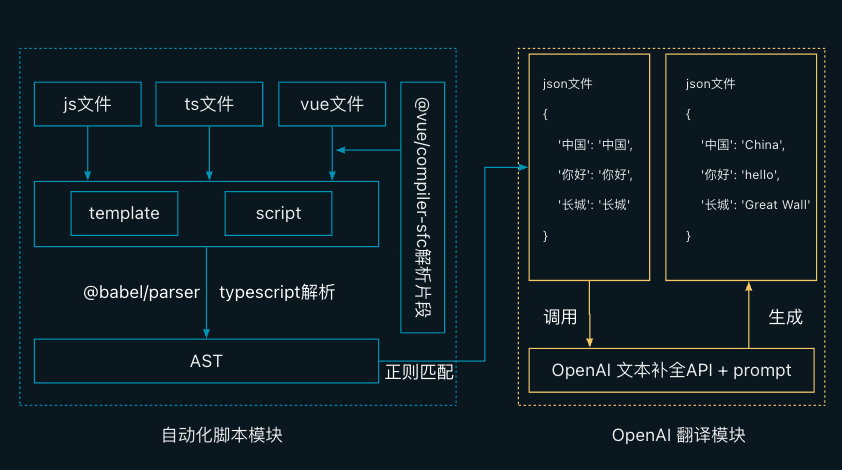

# auto-i18n-tool

## 使用

打开auto-i18n-tool

- `pnpm link -g` 挂载

打开移动端项目

- 执行`pnpm link -g auto-i18n-tool` 软链接到auto-i18n-tool项目
- 参考执行分支`dev/20230912/translate`的`pnpm translate`命令，即`node ./locals/init.js`
- 打开locals\settings.json，看到待翻译的数据结构，让ChatGPT填充英文
- 再次执行`pnpm translate`

> 移除全局下软链的包 `pnpm remove -g auto-i18n-tool`

## 初始化配置

参考移动端项目分支`dev/20230912/translate`，文件目录/locals/init.js

```js
const I18nTool = require('auto-i18n-tool')
const tool = new I18nTool({
  /** 根目录 */
  basePath: './src',
  /** 仅翻译以下目录文件 */
  filePaths: [
    'src/components',
    'src/pages/common',
  ],
  /** 需要跳过的文件 */
  skipFiles: [
    '.d.ts',
    'app.config.ts',
    'src/pages/common/asset/components/manage-popup', // template中有ts，暂不支持
    'src/pages/common/login/components/agree.vue' // template中有ts，暂不支持
  ],
  keyReplace: {
    'src/': ''
  },
  dictPath: './locals',
  langPath: './locals',
  from: 'zh-cn',
  to: 'en-us',
})
tool.start()
```

## 已知问题

1. 脚本帮助每个文件引入了`$t`方法，但有些文件未成功引入。
```js
import i18next from 'i18next';
const $t = i18next.t;
```

2. vue文件的template标签内使用ts，会引起脚本报错。此类文件需要添加到skipFiles跳过。
原因是src/plugins/vue-parser.js中分析vue的parse5包无法识别ts，需要使用@vue/compiler-dom，但需要重新处理AST树。

3. h5页面执行`i18next.changeLanguage('zh')`可以立即切换翻译，小程序需要组件刷新才会更新文案。参考小程序开发文档国际化一项。

## 流程图

